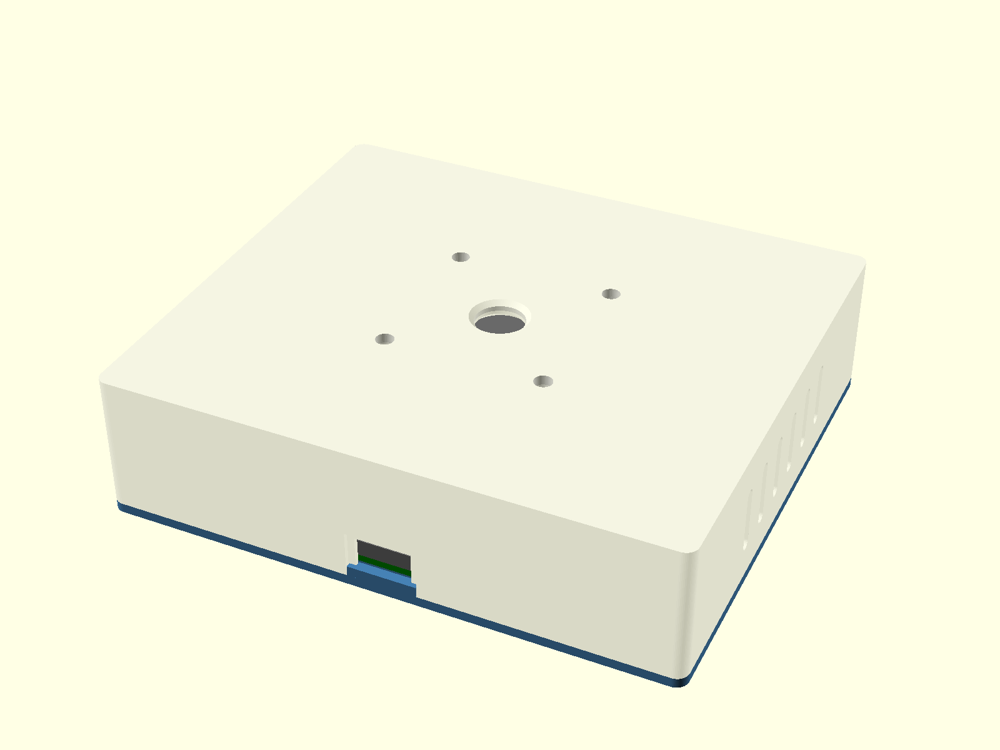

# StatusStackLight

Eine industrielle Signalsäule mit fünf Lampen, gesteuert von einem ESP32-S3 im
3D-gedruckten Sockel – dimmbar, blinkend und pulsierend, per HTTP-API und Web-Interface im
lokalen Netz. Im Alltag zeigt sie an, was die laufenden Claude-Code-Sessions gerade tun.

## Die drei Teile

| Ordner | Inhalt |
|---|---|
| [`enclosure/`](enclosure/OpenSCAD/README.md) | Parametrischer Sockel in OpenSCAD: trägt die Säule und nimmt die gesamte Elektronik auf. Druckfertige STL-Dateien, Druckempfehlung, Montagereihenfolge. |
| [`firmware/`](firmware/README.md) | PlatformIO-Firmware für den ESP32-S3: PWM-Ansteuerung mit Effekten, WLAN-Einrichtung per Captive Portal, Web-Interface, [HTTP-API](firmware/API.md). |
| [`claude-code/`](claude-code/README.md) | PowerShell-Skript, das über Hooks den Zustand von Claude-Code-Sessions auf die Säule bringt. |

Die Teile bauen aufeinander auf, lassen sich aber auch einzeln nutzen: Die Firmware braucht
den Sockel nicht, und die API steht jedem Client offen, nicht nur dem Hook-Skript.

## Hardware

| Bauteil | |
|---|---|
| Signalsäule | 5 Lampen (weiß, blau, grün, orange, rot), 12-V-LED-Module, Flansch mit 4 × M4 auf 55 mm Lochkreis |
| Mikrocontroller | ESP32-S3 DevKitC-1 **N16R8** (16 MB Flash, 8 MB Octal-PSRAM) |
| Treiber | 8-Kanal-MOSFET-Modul, LOW-aktiv; 5 Kanäle belegt |
| Versorgung | USB-C-PD-Triggerboard (fordert 12 V an) → Mini560-Buck → 3,3 V an den 3V3-Pin des ESP32 |
| Sockel | 138,8 × 120,8 × 35,8 mm, PETG oder PLA+, Heat-Set-Inserts 4 × M3 und 4 × M4 |

Pinbelegung, Maße und Details stehen in den READMEs von [`enclosure/`](enclosure/OpenSCAD/README.md)
und [`firmware/`](firmware/README.md).

## Schnellstart

1. **Drucken:** `enclosure/OpenSCAD/body.stl` und `boden.stl`, stützfrei, siehe
   [Druckempfehlung](enclosure/OpenSCAD/README.md#druckempfehlung).
2. **Montieren und verdrahten** nach der
   [Montagereihenfolge](enclosure/OpenSCAD/README.md#montagereihenfolge).
3. **Flashen:** in `firmware/` mit [PlatformIO](https://platformio.org/) `pio run -t upload`,
   siehe [Bauen und flashen](firmware/README.md#bauen-und-flashen).
4. **WLAN einrichten:** Das Gerät öffnet beim ersten Start den Accesspoint
   `StatusStackLight-XXXX`; die Konfigurationsseite erscheint von selbst, siehe
   [WLAN einrichten](firmware/README.md#wlan-einrichten).
5. **Ausprobieren:** `http://statusstacklight.local/` im Browser – jede Lampe lässt sich dort
   einzeln in allen Parametern schalten.
6. Optional: **Claude-Code-Anzeige** einrichten, siehe [`claude-code/`](claude-code/README.md).

## Lizenz

[MIT](LICENSE) – für Firmware, Skripte, Gehäusemodell und Dokumentation.
