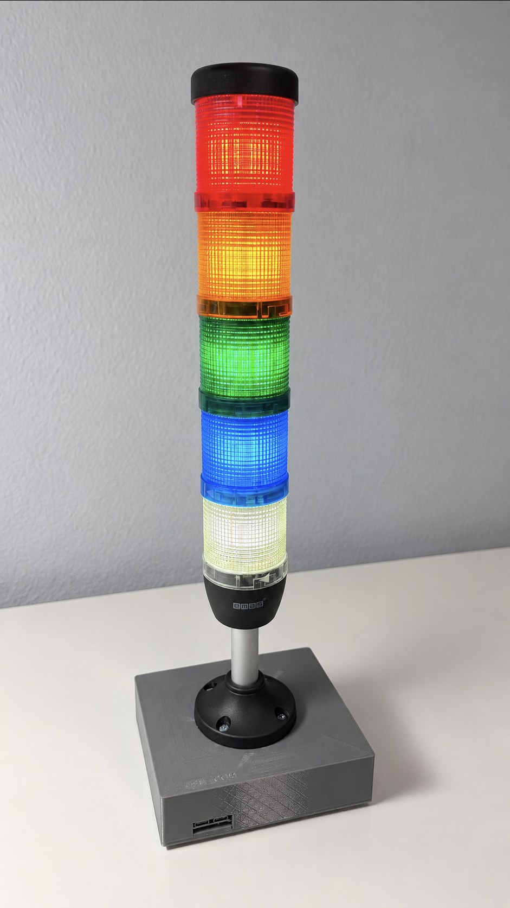

# StatusStackLight

An industrial stack light with five lamps, driven by an ESP32-S3 in a 3D-printed base –
dimmable, blinking and pulsing, via an HTTP API and a web interface on the local network. In
everyday use it shows what the running Claude Code sessions are doing right now – directly on
the local network, or through a relay server from anywhere.

  

## The four parts

| Folder | Contents |
|---|---|
| [`enclosure/`](enclosure/OpenSCAD/README.md) | Parametric base in OpenSCAD: carries the stack light and houses all the electronics. Print-ready STL files, print recommendations, assembly order. |
| [`firmware/`](firmware/README.md) | PlatformIO firmware for the ESP32-S3: PWM drive with effects, WiFi setup via captive portal, web interface, [HTTP API](firmware/API.md). |
| [`claude-code/`](claude-code/README.md) | PowerShell script that brings the state of Claude Code sessions to the stack light via hooks. |
| [`relay/`](relay/README.md) | Optional ASP.NET Core server between hooks and stack light: combines the sessions of several computers, the stack light polls it – no shared network needed. Admin interface for API keys, event rules and appearance. |

The parts build on each other but can also be used on their own: the firmware does not need
the base, the API is open to any client, not just the hook script, and the relay is only
needed when computer and stack light are not on the same network.

## Hardware

| Component | |
|---|---|
| Stack light | 5 lamps (white, blue, green, orange, red), 12 V LED modules, flange with 4 × M4 on a 55 mm bolt circle |
| Microcontroller | ESP32-S3 DevKitC-1 **N16R8** (16 MB flash, 8 MB octal PSRAM) |
| Driver | 8-channel MOSFET module, active LOW; 5 channels used |
| Power | USB-C PD trigger board (requests 12 V) → Mini560 buck → 3.3 V into the ESP32's 3V3 pin |
| Base | 138.8 × 120.8 × 35.8 mm, PETG or PLA+, heat-set inserts 4 × M3 and 4 × M4 |

Pin assignment, dimensions and details are in the READMEs of
[`enclosure/`](enclosure/OpenSCAD/README.md) and [`firmware/`](firmware/README.md).

## Quick start

1. **Print:** `enclosure/OpenSCAD/body.stl` and `base.stl`, support-free, see the
   [print recommendations](enclosure/OpenSCAD/README.md#print-recommendations).
2. **Assemble and wire** following the
   [assembly order](enclosure/OpenSCAD/README.md#assembly-order).
3. **Flash:** in `firmware/` with [PlatformIO](https://platformio.org/) `pio run -t upload`,
   see [Building and flashing](firmware/README.md#building-and-flashing).
4. **Set up WiFi:** on first start the device opens the access point
   `StatusStackLight-XXXX`; the setup page appears by itself, see
   [WiFi setup](firmware/README.md#wifi-setup).
5. **Try it out:** `http://statusstacklight.local/` in the browser – every lamp can be
   switched there individually with all its parameters.
6. Optional: set up the **Claude Code display**, see [`claude-code/`](claude-code/README.md).
7. Optional: run the **relay** on a server, see [`relay/`](relay/README.md), and switch the
   stack light and the hook script to relay mode.

## License

[MIT](LICENSE) – for firmware, scripts, relay, enclosure model and documentation.
