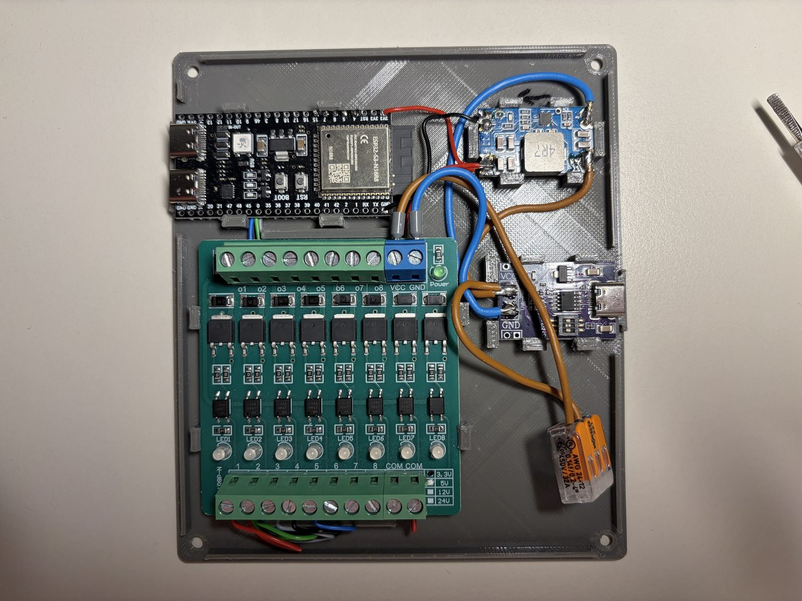
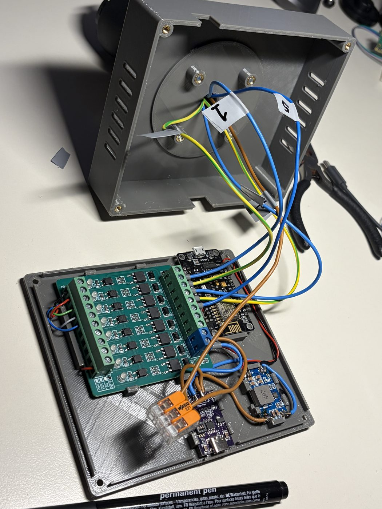

# StatusStackLight – Enclosure (OpenSCAD)

Parametric, 3D-printable enclosure that carries an industrial stack light and houses the
electronics: ESP32-S3 DevKitC-1 (N16R8), 8-channel MOSFET module, Mini560 buck converter
(12 V → 3.3 V) and a USB-C PD trigger board that requests 12 V from the power supply.

**The stack light has 5 lamps.** So only 5 of the 8 MOSFET channels are used; the other
three are deliberately left free. The 8-channel module is in there anyway because it was on
hand – at 68 × 72 × 16 mm it is the largest component and thus determines both the inner
dimensions and the inner height of the enclosure. If you want a smaller box, start there,
not with the microcontroller.

**Stage 1: two parts** – main body with integrated lid + removable base plate.

| File | Contents |
|---|---|
| `statusstacklight_enclosure.scad` | complete model, all dimensions as variables at the top of the file |
| `render.ps1` | generates STLs and preview images from the command line |
| `body.stl` / `base.stl` | exported printable parts (from the current parameters) |
| `preview/` | rendered previews |

Current outer dimensions: **138.8 × 120.8 × 35.8 mm** (interior 134 × 116 × 31 mm).

## Design principles

* **Coordinates:** `x = 0…inner_x` (left→right), `y = 0…inner_y` (front→back), `z = 0` is
  the parting plane = top of the base plate. All layout positions are given in these inner
  coordinates.
* **The base plate carries all the electronics.** It is populated outside the enclosure and
  then slid in vertically from below.
* **Flat top.** The lid is completely smooth on the outside – only the four M4 holes and the
  cable feed-through. A raised centering ring around the stack light base is still in the
  model as `light_centering_ring`, but **disabled**: the main body is printed standing on the
  lid, so the ring would be the only thing resting on the print bed, and the whole remaining
  lid surface would hang 1.2 mm in the air. The flange is centred by the four M4 screws on
  the 55 mm bolt circle anyway.
* **No screws for the boards.** Each board sits on four support pads; along one edge there
  are two rigid support ledges, along the opposite edge two springy snap clips with a 45°
  lead-in chamfer. Slide the board at an angle under the rigid side, press down on the
  opposite side – it snaps in.
* **Closure:** 4 corner bosses with M3 heat-set inserts (Ø 4.0 × 6 mm), M3 countersunk
  screws from below. The countersinks are **conical** (90° per DIN 7991), so the head rests
  flat on the cone flank instead of on an edge. The depth is computed from
  `countersink_angle` and `countersink_d` and not set separately – otherwise the cone no
  longer matches the screw head. A short cylindrical lead-in (`countersink_lead`, 0.3 mm) at
  the outer surface absorbs the elephant's foot of the first layer; the head thus sits about
  0.4 mm below the surface. With a 2.4 mm floor, 0.7 mm of material remains below the
  countersink – the model computes this and warns if it gets too thin.

### USB-C PD trigger board – strain relief

The port sits in the middle of a 20 mm edge and passes through the middle of the front
wall:

* The wall opening (13.5 × 7.5 mm) is **open downwards to the parting plane**, so the
  populated base plate slides in without collisions – and it prints without a bridge.
* A **connector collar** on the base plate fills the slot below the opening again and forms
  the lower edge of the visible opening.
* The port **protrudes 1 mm beyond the board edge** and thus dips into the wall opening
  itself.
* An **outer recess** (17 mm wide, 1.2 mm deep) thins the wall in front of the port.
  Together with the protrusion, only **0.2 mm of wall** remains in front of the port mouth –
  the plug seats practically flush and its full length engages. The model checks this at
  compile time (`usbc_gap`); the recess must not exceed `wall − usbc_protrusion`.
* **Force flow:** The **saddle** below the board's front edge takes downward forces, the
  clips hold upwards, the **stop rib** behind the board takes the plug-in force, and the
  front wall itself (the board edge rests against it left and right of the opening) holds
  against pulling out. The port's solder joints are not loaded in any direction.
* **The stop rib is split in two** (`usbc_rib_gap`, 10 mm): the PD board's solder eyes sit
  at the back centre, and the wires need a way out backwards there. What remains are two
  segments of 7 mm each at the back board corners. For the force flow that is no loss,
  rather the opposite – the plug-in force now goes into the corners instead of the middle,
  so the board is no longer loaded in bending. `usbc_rib_gap = 0` restores the continuous
  rib.

There is clearance all around: the port is guided, not clamped.

## Usage

Everything the repo contains is produced with one call – **without the OpenSCAD GUI**:

```powershell
.\render.ps1                 # body.stl, base.stl and all preview/*.png
.\render.ps1 -Only Stl       # only the printable parts
.\render.ps1 -Only Preview   # only the images (< 1 s per image)
```

The script finds `openscad.exe` by itself (otherwise `-OpenScad <path>`) and finally prints
the model's derived dimensions and collision checks:

```
Inner size  : 134 x 116 x 31 mm
Outer size  : 138.8 x 120.8 x 35.8 mm (flat lid)
USB-C port  : face y=-1  recess floor y=-1.2  remaining wall=0.2 mm  -> OK
Countersink : 90 degrees, depth 1.7 mm  remaining floor=0.7 mm  -> OK
Light bosses: bottom z=21  tallest assembly z=19  -> OK
```

For design work, open the file in the OpenSCAD GUI as usual; `part` switches between
`"both"`, `"body"`, `"base"` and `"explosion"`.

> Pitfall for your own scripts: `openscad.exe` is a GUI subsystem binary and returns
> **immediately** unless PowerShell consumes its output through a real pipeline – an
> assignment like `$log = & $OS @args 2>&1` does **not** wait for rendering to finish.
> `render.ps1` therefore reads through `| ForEach-Object { "$_" }` and additionally checks
> the timestamp of the written file.

`show_boards = true` shows the boards as transparent ghosts (`%`) – they are **not**
included in the render/STL.

## Dimensions

### Measured and confirmed

| Variable | Value | |
|---|---|---|
| `mosfet_h` | 16 | height of the MOSFET module incl. screw terminals |
| `light_base_d` | 70 | outer diameter of the stack light base; determines the lid reinforcement (base + 10 mm) on the inside |
| `light_bolt_circle_d` | 55 | |
| `light_screw_n` | 4 | |
| `pd_w` × `pd_l` | 20 × 31.5 | USB-C PD trigger board |
| `usbc_protrusion` | 1.0 | protrusion of the port beyond the board edge |
| `buck_l` × `buck_w` × `buck_h` | 30 × 18 × 6 | Mini560 – replaces the LM2596, 13 mm shorter and 8 mm lower |
| `mcu_l` × `mcu_w` × `mcu_h` | 57.3 × 28.1 × 5.0 | ESP32-S3 DevKitC-1 N16R8; height = 1.6 board + 3.4 components |
| `mcu_antenna` | 6.3 | overhang of the module's antenna end beyond the board edge |
| `mcu_stop_above` | −0.2 | top of the end stop relative to the board top. Negative, so a tenth of print over-height does not lift the board's front edge; the stop still engages 1.4 of the 1.6 mm edge. |
| `mcu_standoff` | 3.0 | wires are fed into the solder eyes from above, so the solder joints protrude downwards |
| `mcu_usb_edge` / `mcu_com_edge` | 8.0 / 19.5 | port centres from the board edge that is on the **right** inside the enclosure |
| `light_cable_d` | 12 | central cable feed-through in the lid, fits the wires of the 5 lamps |

> **Convention:** all `*_h` are **total heights including the board**, as measured with
> calipers across the whole module. `*_standoff` is the distance of the board underside from
> the parting plane.

### Still open

| Variable | current | Note |
|---|---|---|
| `usbc_recess_d` | 1.2 | only 0.2 mm of headroom left (see above) |

After every change, a new export is enough – layout, enclosure height and all cutouts are
recomputed.

## Layout (inner coordinates)

| Assembly | Size | Area X / Y | Remarks |
|---|---|---|---|
| MOSFET 8-channel | 68 × 72 | 12…84 / 42…110 | Screw terminals face the left/right side walls, clips front/back. Only 5 channels used (5 lamps), 3 stay free. Tallest assembly – sets the inner height. |
| ESP32-S3 | 28.1 × 57.3 | 90…118.1 / 58.7…116 | Rotated 90°, both USB-C ports through the back wall. The module's antenna end overhangs the board edge up to y = 52.4 |
| Mini560 | 18 × 30 | 100…118 / 6…36 | Rotated 90°, front right zone; the clips grip the long edges, the solder pad edges stay free. Front **left** support ledge shifted, see below |
| PD trigger | 20 × 31.5 | 57…77 / 0…31.5 | Port exactly centred in the front wall (x = 67) |

The front left zone (x 12…50, y 0…40) stays free for wiring; the lamp cables run from the
MOSFET terminals to the cable feed-through in the lid.

<p align="center">
  
  <br><em>The populated base plate. The ESP32's two ports point left (the back wall), the
  USB-C power input right (the front wall).</em>
</p>

### Special case: front left support ledge of the Mini560

On the left board edge of the Mini560 (top view of the base plate, USB-C input at the
bottom) a component sits flush with the edge – the support ledge cannot grip there. It
therefore moves **3 mm forward** (`buck_clip_fl_shift`) and is at the same time **4 instead
of 6 mm wide** (`buck_clip_fl_width`), because otherwise it would be in the way of the
solder joint of the plus input. That leaves 3.4 mm to the board's front edge.

| Clip | y | Width |
|---|---|---|
| left back | 27.6 | 6.0 |
| right back | 27.6 | 6.0 |
| right front | 14.4 | 6.0 |
| **left front** | **11.4** | **4.0** |

This is made possible by the optional parameters `clips_fixed` / `clips_spring` of
`board_holder()`: a list `[[position, width], …]` per edge. Without them, the symmetric
default applies (two clips at 28 % and 72 % of the edge length, each `clip_w` wide), so
individual clips can be placed around components without giving up the symmetry for all
other boards.

## Print recommendations

| Part | Orientation | Note |
|---|---|---|
| `body.stl` | **standing on the lid**, opening facing up | support-free: the flat lid surface rests fully on the bed, the connector slots that are open at the bottom then face up, and the chamfer of the cable feed-through is self-supporting as a 45° overhang |
| `base.stl` | flat, clips facing up | support-free; the countersinks face the print bed and are self-supporting at 45° |

* Layer height 0.2 mm, 3 perimeters (4 for the base plate, so the clips do not shear off),
  infill ≥ 25 %.
* Material: PETG or PLA+. PLA clips are more brittle – prefer PETG if you open it often.
* Heat-set inserts: 4 × M3 (Ø 4.0 × 6 mm) in the corner bosses, 4 × M4 (Ø 5.6 × 8 mm) in
  the stack light bosses. Alternatively `light_insert = false` for plain through holes.

## Pin assignment (ESP32-S3 DevKitC-1, N16R8)

| Channel | GPIO |
|---|---|
| 1 | **4** |
| 2 | **5** |
| 3 | **6** |
| 4 | **7** |
| 5 | **15** |

On the S3, PWM is no longer an issue: the LEDC block has 16 independent channels with up
to 14 bits, and **every** GPIO can be routed to it. Five dimmed lamps are thus a few lines
of code.

### Hands off

| Pin | Why |
|---|---|
| **35, 36, 37** | **Octal PSRAM.** The `R8` in N16R8 stands for 8 MB PSRAM, and it runs over exactly these three pins. On the quad variants they would be free – not on this one. |
| 26–32 | SPI flash of the module |
| 0, 3, 45, 46 | strapping pins (boot mode, JTAG source, VDD_SPI) |
| 19, 20 | native USB data lines (the "USB" port) |
| 43, 44 | UART0, the "COM" port |
| 38 (or 48) | on-board RGB LED. DevKitC-1 v1.1 uses GPIO38, v1.0 GPIO48; clones vary – when in doubt, try both. |

The five recommended pins are high-impedance during boot. The MOSFET module switches on at
LOW; if it has no pull-ups on its control inputs, add 10 kΩ to 3.3 V on each, otherwise it
may flicker briefly at power-on.

## Labels of the USB ports

The top of the lid carries engraved text (`mcu_text_depth` = 0.6 mm) above the two ports.
Rotated by 180°, it reads **from behind** – where you plug in.

The port centres are only 11.5 mm apart; at a legible font size "USB" and "COM" run into
each other. The labels are therefore spread apart from the centre via `mcu_text_spread`
(1.6). With only two ports, the left/right assignment stays unambiguous. `1.0` places them
exactly above the port centres – then `mcu_text_size` has to go below about 3.5 mm.

The model estimates the text width (0.95 × size per character, measured on the render) and
warns at compile time if it gets too tight. OpenSCAD cannot measure text.

The main body is printed standing on the lid – the text faces the print bed and comes out
clean, without supports.

## Assembly order

1. Press the inserts into the main body (M3 into the corner bosses, M4 into the stack light
   bosses from the inside).
2. Populate the base plate: press the MOSFET module, ESP32-S3, buck and PD board into the
   clips.
3. Wire up: USB-C PD → 12 V to the MOSFET module and the Mini560 input, output 3.3 V →
   ESP32-S3 (3V3 pin), GPIOs → MOSFET control inputs (pin assignment see above), common
   ground. The 3V3 pin feeds power bypassing the board's voltage regulator. According to
   Espressif, powering via 3V3 and via USB are mutually exclusive – so when flashing via USB
   it is better to disconnect the 3.3 V line (ground may stay).
4. Thread the lamp cables through the lid feed-through and connect them to the MOSFET
   terminals – 5 lamps, so 5 used channels plus a common return.
5. Insert the base plate vertically from below (all three USB-C ports slide into their
   slots) and fasten it with 4 × M3 countersunk screws.
6. Place the stack light in the middle of the lid and fasten it with 4 × M4 – the screws on
   the 55 mm bolt circle take care of the centering.

<p align="center">
  
  <br><em>Between steps 4 and 5: the main body rests on its lid, the lamp cables come through
  the feed-through. Labelling them before they disappear into the terminals saves a lot of
  tracing later.</em>
</p>

## Next stages

Cable strain relief at the USB-C input, dust protection/sealing, wall mounting tabs,
labelling, possibly a three-part design with a separate lid.
